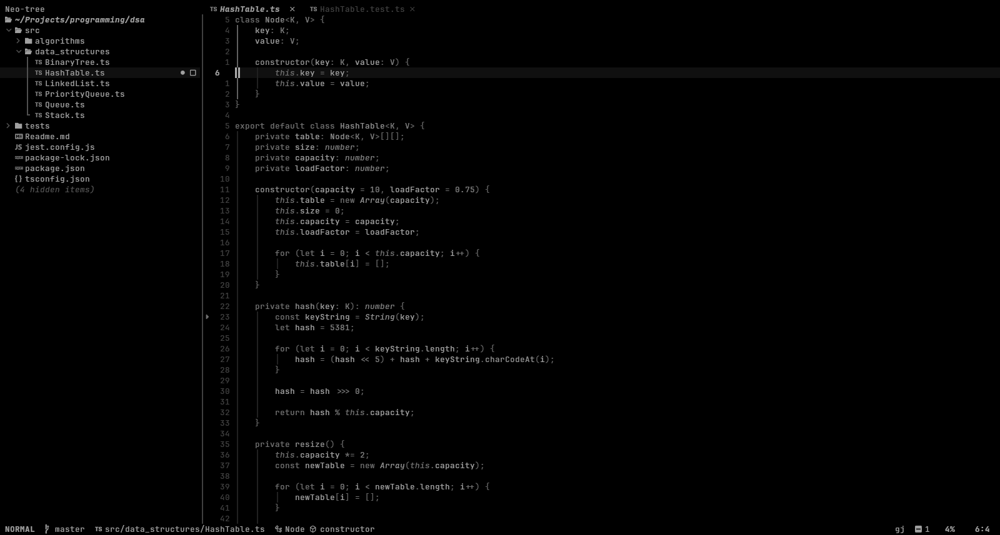

<h1 align="center">
 <p>&lt;O&gt;</p>
 <p align="center">eyes.nvim</p>
</h1>

<p align="center">A monochrome colorscheme for Neovim.</p>

<p align="center">
 
</p>

## Installation

[lazy.nvim]("https://github.com/folke/lazy.nvim")

```lua
{
 "amedoeyes/eyes.nvim",
}

```

lualine

```lua
require('lualine').setup {
 options = {
  theme = 'eyes'
 }
}
```

## Configurations

```lua
require("eyes").setup({
 diagnostics = true, -- enables monochrome for diagnostics
 spell = true, -- enables monochrome for spell checking
})
```
